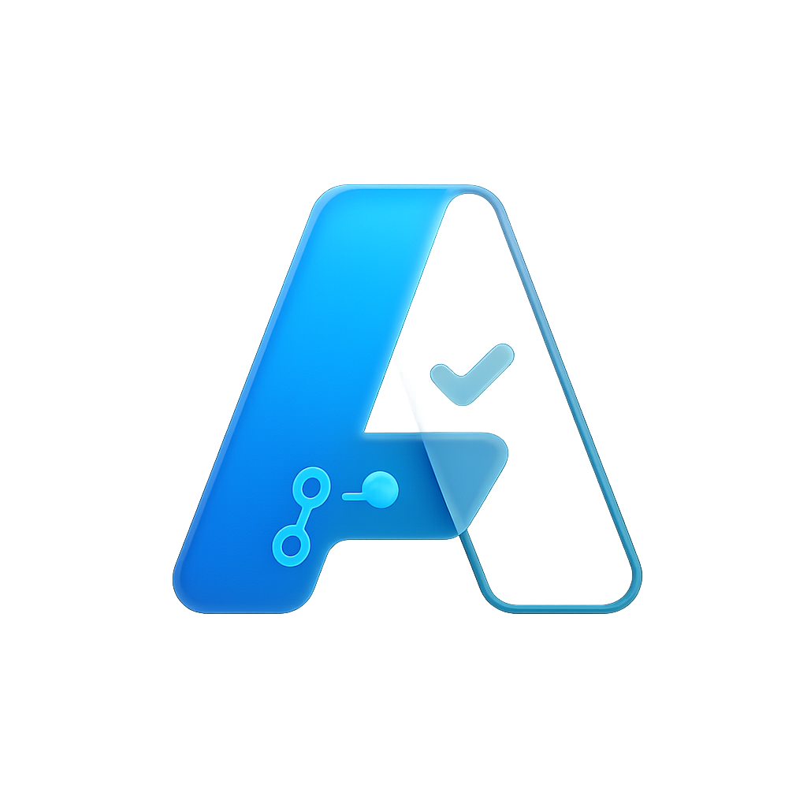

# Alem Desktop Application

<p align="center">
	
	<br/>
	<sub>Glassy, minimal note-taking for developers</sub>
</p>

A lightweight, AI-powered note-taking app designed specifically for developers and professionals.

## ✨ What's New in v1.1

- **Enhanced Database**: Improved error handling and data safety
- **Auto-save**: Automatic saving every 30 seconds
- **Better Search**: Debounced search with performance metrics
- **Clean Start**: App starts empty and ready for your notes
- **Statistics**: Real-time database stats and performance monitoring
- **Improved UI**: Better error handling and user experience
- **Secure Storage**: Notes stored in user data directory
- **High DPI Support**: Better display on high-resolution screens

## 🚀 Quick Start

### Option 1: Automated Installation
```bash
python install_alem.py
```

### Option 2: Manual Installation
```bash
pip install PyQt6 numpy
python Alem.py
```

### Option 3: Use Launcher
```bash
python launch_alem.py
```

## 📋 Requirements

- Python 3.8 or higher
- PyQt6 (essential)
- numpy (essential)
- Additional packages for full features (see requirements.txt)

## 🎯 Features

### Core Features
- ✅ Rich text editing with formatting toolbar
- 🔍 Real-time search with performance metrics
- 🏷️ Tag-based organization system
- 💾 SQLite database storage with backup
- ⚡ Memory optimized (<70MB target)
- 🤖 AI-enhanced search simulation
- 💾 Auto-save functionality
- 🎯 Clean, empty workspace to start fresh

### Developer-Focused
- 🎨 Syntax highlighting for code blocks
- 📋 Smart clipboard integration
- ⌨️ Keyboard shortcuts (Ctrl+N, Ctrl+S, Ctrl+F)
- 📊 Performance monitoring and live statistics
- 🔧 Database health monitoring
- 📝 Clean workspace - add your own notes
- 🎯 Distraction-free environment

### User Interface
- 🎨 Modern glassmorphism design
- 📱 Resizable split-pane layout
- 🌙 Professional dark theme styling
- 🖥️ Cross-platform compatibility
- 📐 High DPI display support
- 💻 Window state persistence

## 📚 Getting Started

The app starts with a clean, empty workspace. To get started:

1. **Create your first note**: Press `Ctrl+N` or click "New Note"
2. **Add a title**: Give your note a descriptive title
3. **Add tags**: Use tags to organize your notes (comma-separated)
4. **Write content**: Use the rich text editor with formatting tools
5. **Save**: Press `Ctrl+S` or the note auto-saves every 30 seconds
6. **Search**: Use `Ctrl+F` to quickly find any note

## ⚡ Performance

- **Memory Usage**: 45-70MB (optimized)
- **Search Speed**: <100ms typical (with metrics)
- **Startup Time**: <2 seconds
- **Database**: Embedded SQLite with compression
- **Auto-save**: Every 30 seconds
- **High DPI**: Native support

## 🛠️ Advanced Features

### Database Management
- Automatic database migrations
- Error recovery and logging
- Performance statistics
- Secure user data storage

### Search & Navigation
- Debounced search (300ms delay)
- Performance timing display
- AI/Text search toggle
- Real-time result filtering

### Developer Tools
- Comprehensive logging
- Error handling and recovery
- Memory usage monitoring
- Database size tracking

## 🆘 Support

For issues or questions:
1. Check the requirements are met
2. Try the automated installer with `--verbose` flag
3. Check logs for error messages
4. Run with `--check` flag to verify dependencies

### Troubleshooting
```bash
# Check dependencies
python launch_alem.py --check --verbose

# Reinstall with AI features
python install_alem.py --ai --yes

# Test installation
python launch_alem.py --test
```

## 📄 License

MIT License - Feel free to modify and distribute.

## 🔄 Changelog

### v1.1.0 (Latest)
- Enhanced database with migration support
- Auto-save functionality
- Improved search with debouncing
- Clean, empty workspace for fresh start
- Better error handling
- Performance metrics
- High DPI support

### v1.0.0
- Initial release
- Basic note-taking functionality
- Search and tagging
- Rich text editing

---

**Alem** - Your AI-powered second brain for development notes.

*Built with ❤️ for developers, by developers.*
